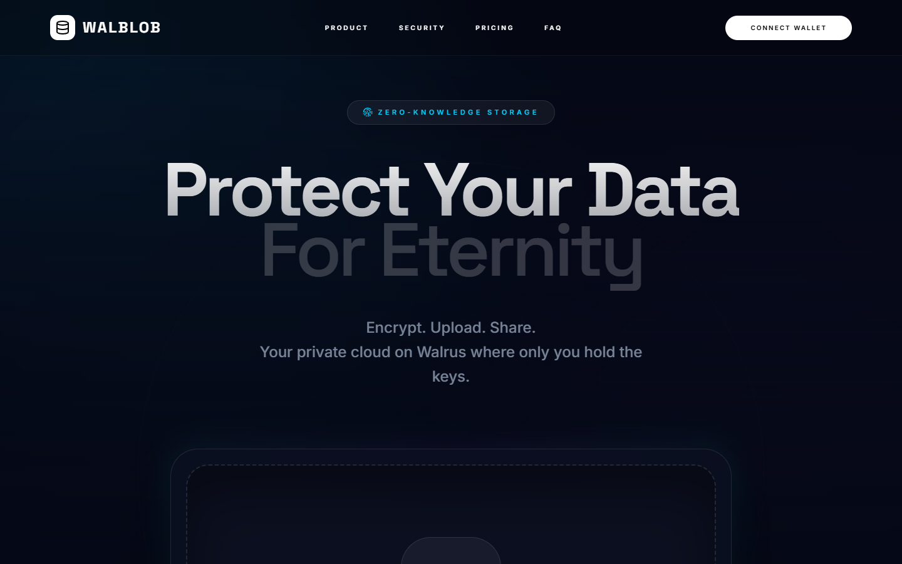
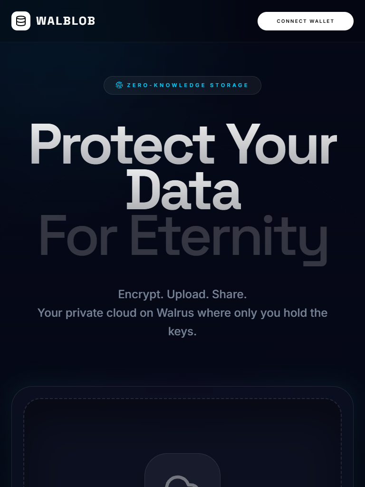
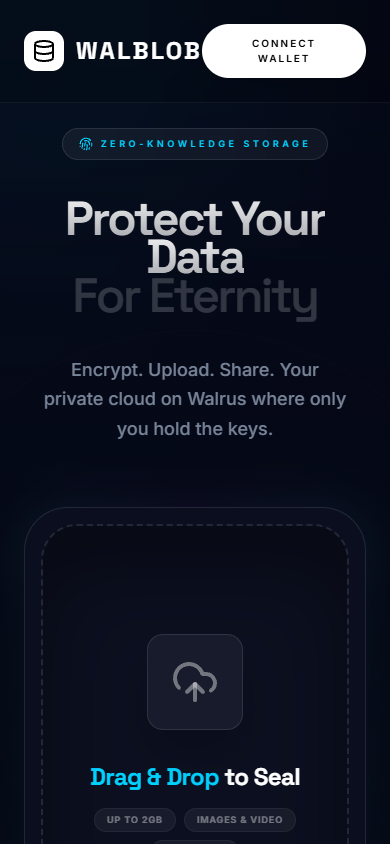

# walblob

**Zero-Knowledge Encrypted Storage on Walrus.**

WalBlob is a premium, open-source encrypted storage frontend powered by the **Walrus** decentralized network. It provides a world-class SaaS interface while maintaining absolute privacy through client-side encryption.

---

## ⚡ Overview

WalBlob ensures your data remains yours. By utilizing client-side encryption, your files are sealed before they ever leave your browser.

- **Client-side Encryption**: Your data is encrypted locally using the Web Crypto API.
- **AES-256-GCM**: Industry-standard authenticated encryption for maximum security.
- **Walrus Decentralized Storage**: Leveraging the Sui ecosystem for permanent, robust data storage.
- **Recovery Workflow**: Seamless retrieval and decryption of blobs using your unique keys.

## ✨ Features

- **AES-GCM Encryption**: Secure authenticated encryption for every blob.
- **Zero-Knowledge Architecture**: Keys never touch any server or decentralized node.
- **Walrus Uploads**: Direct integration with Walrus Publisher nodes.
- **Blob Recovery**: Intuitive interface to retrieve and decrypt stored data.
- **Metadata Preservation**: Original filenames and types are preserved in secure metadata.
- **Recovery Packages**: Export `.walblob` files containing everything needed for retrieval.
- **Batch Uploads**: Queue multiple files for sequential background processing.
- **Local Vault**: Keep track of your upload history securely in your browser.
- **QR Recovery**: Quick mobile-to-desktop recovery via secure QR codes.
- **Premium UI**: Modern SaaS aesthetic with glassmorphism and fluid animations.

## 📸 Screenshots


*Desktop View*


*Tablet Responsive Design*


*Mobile Optimization*

## 🚀 Installation

1. Clone the repository:
   ```bash
   git clone https://github.com/Juniorj87/walblob.git
   cd walblob
   ```

2. Install dependencies:
   ```bash
   npm install
   ```

3. Setup environment variables:
   ```bash
   cp .env.example .env
   ```

4. Run development server:
   ```bash
   npm run dev
   ```

## 🏗️ Build

To generate a production-ready build:

```bash
npm run build
```

The output will be in the `dist/` directory.

## ⚙️ Environment Variables

Create a `.env` file in the root directory:

```env
# Optional: Override default mainnet URLs
# VITE_WALRUS_MAINNET_PUBLISHER_URL=https://publisher.walrus.space
# VITE_WALRUS_MAINNET_AGGREGATOR_URL=https://aggregator.walrus.space
```

## 🔒 Security Model

- **Local Keys**: Encryption keys are generated in your browser and are never transmitted.
- **In-Memory Only**: By default, keys exist only during the session unless exported as a recovery file.
- **Authenticated Encryption**: AES-GCM ensures that your data cannot be tampered with while stored.

## 🔄 Recovery Workflow

### Upload Path
**File** → **Encrypt (Local)** → **Walrus (Upload)** → **Blob ID + Key**

### Retrieval Path
**Blob ID + Key** → **Recover (Fetch)** → **Decrypt (Local)** → **Download**

## 🗺️ Roadmap

### v2.2 (Coming Soon)
- Bundle size optimization (< 150kB)
- Enhanced metadata indexing
- Improved recovery package compression

### v3.0 (Planned)
- Multi-user profiles
- Expiring shared recovery links
- Collaborative Team Vaults

## 📜 License

Distributed under the MIT License. See `LICENSE` for more information.

---

Built with ❤️ for the permanent web.
